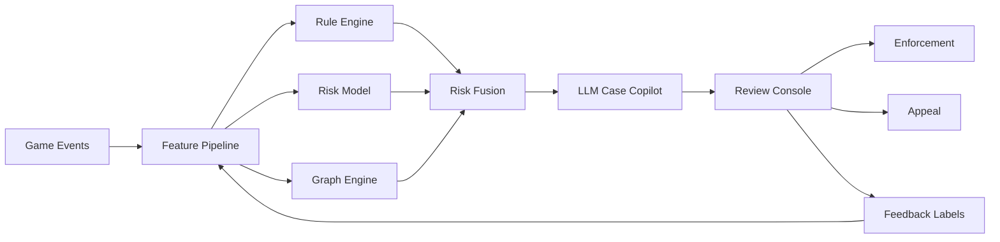

# 乐狗游戏大模型算法工程师面试项目参考：面向《万龙觉醒》类 SLG 的游戏反坏系统

更新时间：2026-06-24

## 使用定位

这是一份用于投递/面试“大模型算法工程师 - 游戏反坏系统”岗位的项目方案参考。它基于《万龙觉醒》（Call of Dragons）公开玩法资料和 SLG/4X 手游的通用风控经验整理，不声称掌握乐狗游戏内部数据或内部反作弊方案。

边界说明：

- 本文只从防守侧讨论风险识别、数据建模、审核闭环和大模型应用。
- 不提供外挂实现、绕过反作弊、刷资源脚本、黑产操作流程等细节。
- “可能作弊手段”均以风险分类和检测口径描述，服务于面试项目设计。

## 一句话项目包装

面向《万龙觉醒》类全球化 SLG，设计并实现一个“大模型辅助的游戏反坏风控平台”：融合服务端行为规则、账号/设备/联盟图谱、资源经济异常检测、脚本行为识别、举报/聊天审核和 LLM 运营 Copilot，实现对资源工作室、自动化脚本、多开账号团伙、恶意联盟行为、交易欺诈和社区违规的识别、解释、审核与处置闭环。

适合简历标题：

> 大模型辅助的 SLG 游戏反坏系统：资源工作室识别、账号团伙图谱、脚本行为检测与审核 Copilot

## 对《万龙觉醒》玩法的业务理解

《万龙觉醒》是幻想题材 SLG/4X 手游，核心体验包括城建、英雄养成、资源采集、联盟协作、赛季推进、地图探索、PvE/PvP 战斗、巨兽/Behemoth 争夺和大规模多人对抗。

公开资料可确认的关键玩法：

- 大地图行军与探索：玩家在开放地图上派遣部队移动、采集、打野、占点、参战。
- 资源与城建：通过采集、任务、活动和建筑产出积累资源，用于升级建筑、科技、训练部队。
- 英雄和宝物：英雄、技能、宝物/Artifact、兵种搭配影响战斗表现。
- 联盟体系：联盟成员协作扩张、占领、集结、支援、共同参与活动和战争。
- 赛季制与服务器生态：SLG 常见的赛季推进、跨服或阶段性目标会放大联盟组织和资源竞争。
- 巨兽/Behemoth：大型 PvE/PvP 目标通常会成为联盟协作、地图控制和战力竞争焦点。
- 社区强依赖：联盟聊天、跨服社区、攻略站、Discord/贴吧/TapTap/Reddit 等会影响玩家组织和舆情。

可参考公开入口：

- [Call of Dragons official site](https://www.callofdragons.com/)
- [Call of Dragons Google Play](https://play.google.com/store/apps/details?id=com.farlightgames.samo.gp)
- [Call of Dragons App Store](https://apps.apple.com/us/app/call-of-dragons/id1605557132)
- [Call of Dragons Wiki](https://call-of-dragons.fandom.com/wiki/Call_of_Dragons_Wiki)
- [Call of Dragons Guides](https://www.callofdragonsguides.com/)

## SLG 反坏为什么重要

SLG 和 FPS/MOBA 不一样，反坏重点不只是“谁开挂赢了一局”。SLG 的问题更偏经济、组织、长期生态和社区治理：

- 资源积累会影响长期战力，资源异常会破坏付费与公平。
- 联盟是强组织形态，团伙作弊比单号作弊更关键。
- 地图行为可自动化，脚本可显著降低玩家时间成本。
- 多开、云手机、模拟器、工作室会放大账号规模优势。
- 赛季制会让黑产在关键节点集中爆发。
- 全球化社区多语言沟通，会带来辱骂、骚扰、诈骗、广告和账号交易风险。

因此，项目应从“单账号检测”升级为“账号-设备-行为-资源-联盟-社区”的综合反坏系统。

## 可能存在的风险场景

以下是防守侧风险假设，不代表对具体游戏现状的断言。

| 风险类型 | 典型表现 | 影响 | 推荐检测对象 |
| --- | --- | --- | --- |
| 自动化脚本 | 自动采集、自动打野、自动做日常、自动回城补给 | 破坏资源公平，降低活跃真实性 | 账号行为序列、行军路径、操作间隔 |
| 多开/云手机/工作室 | 大量新号同步注册、同设备/同网络/同模式成长 | 资源产出、账号售卖、活动刷榜 | 设备图谱、IP/ASN、账号群组 |
| 资源工作室 | 低付费小号长期产出资源，集中服务核心号或出售账号 | 破坏经济和付费平衡 | 资源流、联盟关系、账号成长曲线 |
| 账号交易/代练 | 登录地突变、设备频繁切换、战力异常跃迁 | 账号安全和灰产 | 登录图谱、设备指纹、操作风格 |
| 宏/模拟器滥用 | 固定时间间隔、高重复路径、异常在线时长 | 降低操作门槛，制造不公平 | 操作节奏、路径重复度、活跃分布 |
| 战斗外挂/客户端篡改 | 异常战斗结果、非法状态、异常技能/冷却/伤害 | 直接破坏竞技公平 | 服务端校验、战斗日志、客户端完整性 |
| 联盟恶意行为 | 间谍号、恶意踢人、恶意集结、刷举报、刷联盟贡献 | 破坏社区和赛季生态 | 联盟图谱、权限行为、举报质量 |
| 聊天/社区违规 | 辱骂、骚扰、诈骗广告、外挂广告、账号交易 | 破坏社区安全和合规 | 多语言文本/语音审核 |
| 支付/退款欺诈 | 异常充值退款、代充、黑卡、礼品卡风险 | 收入和合规损失 | 支付风控、账号设备关联 |

## 项目目标

### 业务目标

- 降低资源工作室和脚本账号对游戏经济的污染。
- 提升作弊/违规 case 的发现速度和审核效率。
- 降低误封率，提升申诉处理质量。
- 给运营团队提供可解释的风险证据链。
- 用大模型提升多语言社区治理、举报处理和反坏分析效率。

### 技术目标

- 建立 SLG 反坏数据模型：账号、设备、行为、资源、战斗、联盟、聊天。
- 建立多层检测体系：规则、经典模型、图模型、序列模型、大模型 Copilot。
- 建立人审闭环：模型分、证据、审核结论、申诉、样本回流。
- 建立可解释输出：为什么风险高、证据是什么、建议处置是什么。

## 系统架构

```text
game server events
  -> realtime event bus
  -> feature pipeline
  -> rule engine
  -> risk models
  -> graph engine
  -> LLM case copilot
  -> review console
  -> enforcement / appeal / feedback

community reports + chat
  -> moderation model
  -> LLM summary and policy mapping
  -> review console
  -> warning / mute / ban / education
```

核心模块：

- Event Collection：登录、设备、行军、采集、战斗、联盟、聊天、支付、举报事件。
- Feature Store：账号粒度、设备粒度、联盟粒度、赛季粒度特征。
- Rule Engine：高精度规则，负责明显异常和强约束。
- Risk Model：LR/GBDT/XGBoost 等可解释模型，做风险融合。
- Sequence Model：用于脚本行为、路径重复、操作节奏异常。
- Graph Engine：账号团伙、设备群、联盟关系、资源流、举报网络。
- LLM Copilot：case 摘要、证据解释、审核辅助、申诉分流、情报摘要。
- Review Console：审核员工作台，展示证据链和推荐处置。
- Feedback Loop：人审结论回流训练集和规则库。

## 数据埋点设计

### 账号与设备

- account_id、server_id、season_id、country/region。
- device_id、os、emulator_flag、client_version、risk_env_flags。
- login_ip、ASN、geo、login_time、session_length。
- account_age、level、power、VIP/付费段位、历史处罚。

### 资源经济

- resource_type、resource_gain、resource_spend、resource_balance。
- gain_source：采集、任务、活动、礼包、战斗、联盟收益等。
- spend_target：建筑、科技、训练、治疗、加速、交易/转移类行为。
- gathering_start/end、node_type、march_id、location、yield。
- daily gain/spend ratio、资源留存、资源消耗效率。

### 地图与行为序列

- march_start/end、path_length、target_type、target_level。
- action_type、action_interval、click/command timestamp。
- PvE target、采集点、城池、联盟建筑、巨兽目标。
- teleport、shield、scout、rally、reinforce、withdraw。

### 战斗

- attacker/defender、troop_type、hero/artifact、power、buff。
- damage、loss、healing、battle_duration、win/loss。
- abnormal outcome flags：服务端规则计算出的不可能状态。

### 联盟和社交

- alliance_id、role、join/leave、rank change。
- donation、help、rally participation、territory interaction。
- chat text、language、report、mute/ban、toxic labels。
- invite/referral、same-alliance account clusters。

## 特征工程

### 脚本/自动化特征

- 操作间隔熵：脚本通常间隔更稳定。
- 日内活跃分布：超长在线、跨时区无休眠。
- 路径重复度：采集路线、打野路线高度重复。
- 目标选择规律：固定等级、固定距离、固定收益点。
- 反应时间异常：事件触发后几乎固定延迟响应。
- 操作组合模板：日常任务序列高度一致。

### 资源工作室特征

- 低付费/低社交账号产出高资源。
- 资源收益与战力成长不匹配。
- 大量账号同时间段采集、同区域活动。
- 账号间存在设备/IP/联盟/登录模式关联。
- 赛季关键节点前后资源行为异常放大。

### 账号团伙图谱特征

- 同设备、多账号、同 ASN、同登录窗口。
- 账号创建时间聚集。
- 联盟内小号密度异常。
- 举报/被举报关系集中。
- 支付、退款、设备、地理位置异常关联。

### 联盟生态特征

- 联盟中异常账号占比。
- 集结/支援参与模式高度机械。
- 关键事件前大量新号入盟。
- 联盟贡献、采集、打野行为结构异常。
- 举报网络是否被少数账号操控。

## 模型方案

### 第一阶段：规则 + 可解释经典模型

推荐面试里先讲这一层，因为游戏风控非常重视误封、解释和运营可控。

- Rule Engine：强约束和高精度规则。
- LR/GBDT/XGBoost：融合账号、设备、行为、资源、举报特征。
- Isolation Forest/聚类：发现新型工作室和异常群。
- Graph rules：同设备/同网络/同联盟的团伙识别。

输出：

- risk_score。
- risk_reason_codes。
- evidence_items。
- recommended_action：观察、限权、人审、警告、临时封禁、永久封禁。

### 第二阶段：序列模型和图模型

用于传统规则难覆盖的复杂模式：

- Transformer/TCN：建模操作序列、行军路径、打野/采集节奏。
- GNN/GraphSAGE：账号-设备-IP-联盟-举报-支付关系图。
- Contrastive learning：学习正常玩家和脚本账号行为 embedding。
- HDBSCAN/社区发现：发现新工作室簇。

注意：

- 序列模型不应单独永久封禁。
- 图模型更适合发现团伙，再交由规则/人审确认。

### 第三阶段：大模型反坏 Copilot

大模型在这个项目里的定位不是直接判封，而是提升运营和审核效率。

能力设计：

- Case Summary：把账号画像、资源曲线、行为异常、关联图谱、举报内容总结成审核摘要。
- Evidence Explanation：把模型特征转成审核员能理解的风险原因。
- Policy Mapping：把聊天/举报内容映射到处罚规则。
- Appeal Triage：区分误封申诉、账号被盗、第三方软件、恶意举报、作弊申诉。
- Threat Intel Digest：汇总公开社区、客服工单、异常报告，形成趋势报告。
- SQL/Feature Assistant：辅助算法和运营同学查询异常 cohort。
- Multilingual Moderation：对联盟聊天和社区内容做多语言审核和摘要。

LLM 输入要做权限控制：

- 不输入完整检测规则和阈值。
- 不输入敏感个人信息，必要时脱敏。
- 不让 LLM 直接执行封禁。
- 所有 LLM 输出必须可追溯到原始事件和证据。

## 处置策略

按风险分层，而不是“一刀切永久封禁”：

| 风险等级 | 动作 | 说明 |
| --- | --- | --- |
| 低 | 静默观察、增加采样、匹配/活动降权 | 避免误伤，收集更多证据。 |
| 中 | 人审、临时限制、取消异常收益、警告 | 适合脚本疑似、资源异常、举报集中。 |
| 高 | 封禁波次、设备/账号关联处罚、排行榜剔除 | 需要多证据链和审核确认。 |
| 社区违规 | 警告、禁言、聊天限权、临时封禁 | 结合多语言审核和人工复核。 |
| 账号安全 | 冻结、二次验证、找回流程 | 防止盗号和误判作弊。 |

## 评估指标

### 检测效果

- Precision、recall、false positive rate。
- 人审命中率：模型推送 case 中最终确认违规的比例。
- Time-to-detect：从异常出现到进入审核队列的时间。
- 新工作室发现时间。
- 封禁后回流率和复犯率。

### 经济健康

- 异常资源产出占比。
- 高风险账号资源贡献占比。
- 资源/战力成长分布是否恢复。
- 赛季关键节点异常账号活跃度。

### 玩家体验

- 玩家举报量和有效举报率。
- 误封申诉率、申诉成功率、处理时长。
- 公平性感知问卷或社区舆情。
- 正常玩家留存和付费是否受处罚策略影响。

### 审核效率

- 每个审核员日处理 case 数。
- LLM 摘要节省的平均审核时间。
- Case summary 被采纳率。
- 审核结论一致性。

## 面试可讲的技术亮点

1. 游戏业务理解：SLG 的反坏核心是资源经济、账号团伙、联盟生态和长期赛季公平。
2. 模型务实：先规则和 GBDT，不上来就端到端深度学习，体现风控可解释性。
3. 大模型落点准确：LLM 不直接封禁，而做 Copilot、摘要、申诉、情报和多语言审核。
4. 图谱思维：从单账号扩展到账号-设备-IP-联盟-举报-支付关系图。
5. 闭环思维：模型、人审、申诉、样本回流、规则迭代。
6. 误封意识：游戏反坏的核心不是“抓得越多越好”，而是证据链可靠、处置分层。

## 简历项目写法

可以这样写：

> 设计并实现面向 SLG 手游的游戏反坏风控系统，围绕资源工作室、自动化脚本、多开账号团伙、联盟恶意行为和聊天违规构建多层检测链路。负责账号/设备/资源/行军/联盟/举报等多源事件建模，使用规则引擎 + GBDT 风险评分 + 图谱聚类识别高风险账号群，并引入大模型 Copilot 生成审核摘要、证据解释和申诉分流。系统支持人审反馈回流，优化误封率和审核效率。

如果需要量化但没有真实线上数据，可以写成实验口径：

> 在模拟 SLG 事件数据和人工构造风险样本上验证方案，模型审核队列命中率较纯规则提升 X%，LLM case summary 将单 case 初审时间降低 X%，误封样本通过多证据门控降低 X%。

注意：没有真实数据时，不要虚构线上指标。可以说“离线模拟”“原型验证”“方案设计”。

## 面试讲述提纲

### 1. 为什么 SLG 反坏不同

FPS 反作弊关注单局公平，SLG 反坏更关注长期资源经济、联盟生态、账号团伙和赛季公平。《万龙觉醒》这种游戏有资源采集、联盟协作、地图行军、英雄养成和大规模战争，所以反坏系统要看账号群和资源流，不只看单账号。

### 2. 我会怎么建系统

先做服务端事件埋点和特征仓库，再上规则和 GBDT 做可解释风险评分。对多开和工作室，用图谱把账号、设备、IP、联盟和举报关系连起来。对脚本行为，用操作序列、路径重复度、在线节奏和反应时间特征。大模型用于审核 Copilot：总结证据、解释风险、处理多语言举报和申诉。

### 3. 为什么不让大模型直接封禁

游戏封禁需要证据链和可申诉。LLM 容易幻觉，也不适合掌握敏感阈值。所以 LLM 只做摘要和辅助决策，最终由规则、模型分、人审和处罚策略共同决定。

### 4. 如何控制误封

采用多证据门控：单一异常只观察，不直接封禁；高风险需要行为异常、账号关联、资源异常、举报或客户端风险多证据一致。处罚分层，从观察、人审、警告、限权到封禁波次。

### 5. 后续怎么迭代

把人审和申诉结论回流，做 hard negative 挖掘；对新型工作室做无监督聚类；对联盟级作弊做图模型；对聊天和多语言社区治理上 LLM moderation 和 case summary。

## 可准备的追问回答

### 为什么不用纯深度学习？

游戏风控误封代价高，需要解释和申诉。早期用规则、LR/GBDT、图规则更稳。深度学习适合路径序列、回放、复杂行为 embedding，但不应单独判封。

### 大模型价值在哪里？

大模型适合处理非结构化信息和降低运营成本，例如举报文本、聊天内容、申诉工单、case summary、规则说明、威胁情报摘要。它不是反作弊裁判，而是审核和分析 Copilot。

### 如何识别工作室？

从账号群看，不只看单号：同设备/同网络/同时间注册，同类成长路径，资源产出高但社交/付费/战力不匹配，联盟内小号密度异常，行为序列高度模板化。

### 如何避免误伤高肝玩家？

加入 hard negative：高活跃正常玩家、高付费玩家、核心联盟玩家、赛事玩家。用多证据门控，单纯在线时长或高资源产出不能封禁，必须结合操作节奏、路径重复、账号关联和资源使用异常。

### 如果没有真实标签怎么办？

先用规则高置信样本、人审样本、举报确认样本做 weak labels；用无监督发现异常群；通过审核台积累标签；训练时区分 confirmed bad、suspected、normal、trusted normal。

## 项目里可以画的图



## 建议后续补充材料

- 准备 1 页架构图。
- 准备 1 页数据表和特征例子。
- 准备 1 页“为什么 LLM 不直接封禁”的说明。
- 准备 1 个案例：资源工作室账号群如何被发现、审核、处置、回流。
- 准备 1 个案例：聊天违规/外挂广告如何用 LLM 审核和申诉分流。

